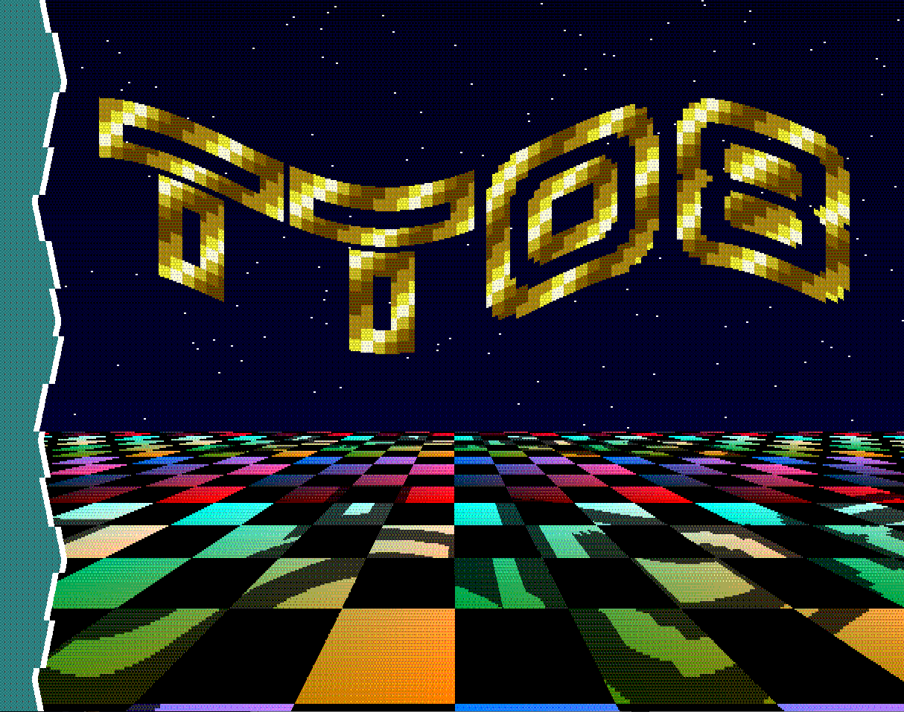

<!---

This file is used to generate your project datasheet. Please fill in the information below and delete any unused
sections.

You can also include images in this folder and reference them in the markdown. Each image must be less than
512 kb in size, and the combined size of all images must be less than 1 MB.
-->

# a1k0n's tinytapeout08 demo compo entry



## How it works

It's a standalone VGA+sound demo that fits in two tiles; you'll just have to
see. The demo is short, looping after about 25 seconds.

This was developed with a 48MHz clock, so it's in a funky VGA video mode -- it's
standard 640x480@60Hz VGA timing and 4:3 aspect ratio, but with 1220 horizontal
pixels instead of 640.  All graphics are dithered down to RGB222 with a Bayer
matrix which alternates each frame. Because of the dithering and the weird
resolution, it looks best on a real CRT, but any VGA monitor ought to work.

Sound is generated using a 16-bit sigma-delta DAC on io7 from an internal
3-channel synth (triangle, noise, and square waves).

Sines and cosines are generated by an old HAKMEM trick which generates a
slightly off-center circle but that doesn't matter in this application:
```
  cos_new = cos - (sin>>k)
  sin_new = sin + (cos_new(!)>>k)
```

The plane is rendered by doing a bit-by-bit non-restoring division of the y
coordinate during the horizontal blanking interval to find a fixed point
reciprocal, which is then used as an x increment for the plane u coordinate. As
a drastic simplification, the plane v coordinate is *also* the x increment value
(when you do the math, it turns out they are proportional).

Starfield is generated by an LFSR that increments every line which provides an
x-offset and speed for each star by picking out individual bits of the LFSR
state.

The "TT08" logo uses the outline of an old demo font, but the actual coloring is
procedural as it would take too much combinational logic to reproduce exactly.

Soundtrack is a riff on "Crooner" by Drax/Vibrants, composed as a bunch of text
in a Python script with limitations on song structure and octave range. Kick
drum and bass share the triangle channel, lead arpeggios on square, and hihat 
noise.

I'm not super happy about the "programmer colors" everywhere, but I ran out of
room trying to add palettes.

## How to test

Run clock at 48MHz, connect VGA and sound Pmods, and give it a reset pulse (falling edge).

## External hardware

Follows the [democompo hardware rules](https://tinytapeout.com/competitions/demoscene/#what-are-the-rules):

[TinyVGA Pmod](https://github.com/mole99/tiny-vga) for video on o[7:0].

1-bit sound on io[7], compatible with [Tiny Tapeout Audio
Pmod](https://github.com/MichaelBell/tt-audio-pmod), or any basic ~20kHz RC filter
on io7 to an amplifier will work.